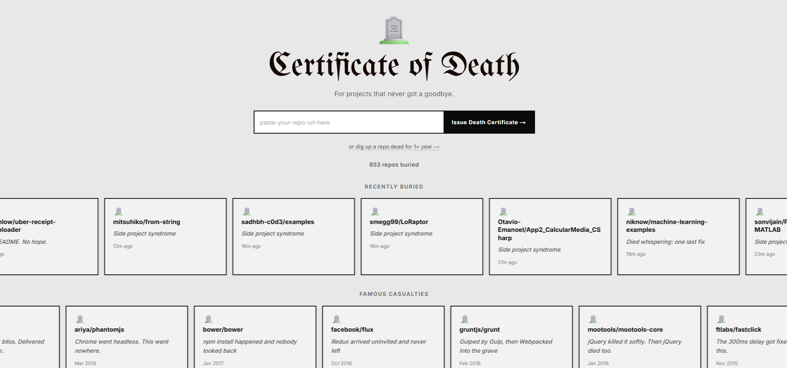
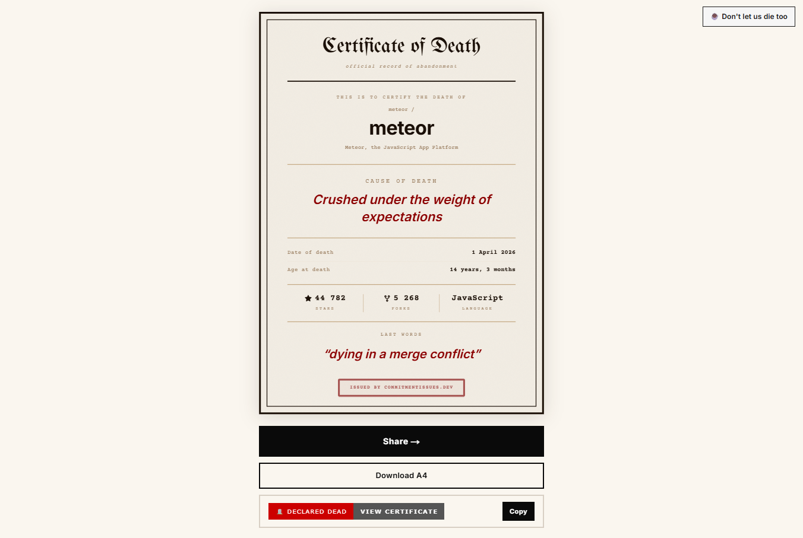
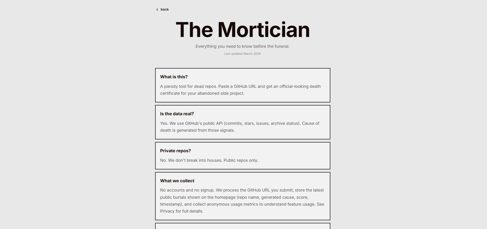

[](https://commitmentissues.dev/?repo=atom%2Fatom)

# Commitment Issues

Death certificates for abandoned GitHub repositories.

[**commitmentissues.dev**](https://commitmentissues.dev) &nbsp;·&nbsp; built by [Dot Systems](https://github.com/dotsystemsdevs)

[](LICENSE)
[](https://nextjs.org)
[](https://commitmentissues.dev)

Paste a public GitHub URL — or a username — and get a shareable certificate of death. Algorithmic cause of death, last commit as last words, repo age, exportable graphics. Or run an autopsy across an entire profile and get a graveyard report. No signup, no account, free.



## Two ways in

- **Certify a repo** — paste a GitHub URL, get a printable A4 certificate of death.
- **Examine a profile** — paste a username, get a graveyard report of every dead, struggling, and alive repo, plus a README badge you can embed.

## Embed your graveyard

Copy the generated `` markdown from any profile page and paste it in a README:

```
🪦 GITHUB REPO GRAVEYARD
94 DEAD · 35 STRUGGLING · 14 ALIVE
```

The badge is rendered live, refreshes through GitHub's image proxy within minutes, and links back to the full profile graveyard.

## Features

- **Certificate of death** — A4 layout with cause, last words, age, stars, forks, and language.
- **Profile graveyard** — scan any user's public repos, grouped by Dead / Struggling / Alive, with per-repo descriptions and one-click certificate links.
- **README badge** — dynamic SVG (`/api/badge?username=…`) showing live dead / struggling / alive counts.
- **Algorithmic scoring** — the death index in [`src/lib/scoring.ts`](src/lib/scoring.ts) weighs commit recency, archive status, open issues, fork ratio, and commit-message tells.
- **Export** — PNG downloads in A4, Instagram (4:5 and 1:1), X (16:9), Facebook (1.91:1), and Stories (9:16).
- **Mobile share** — native share sheet on iOS / Android with a story-formatted image; desktop falls back to X intent + clipboard + downloads.
- **Hall of Fame ticker** — curated marquee of historically abandoned repos with click-to-light candle counts.
- **Live counters** — buried + profiles scanned, animated on load and persisted in Redis.
- **Rate limiting** — Redis-backed per-IP throttling with graceful no-op when Redis isn't configured.
- **Hardened API calls** — `AbortSignal.timeout` on every GitHub fetch, segment allowlist on every owner/repo input.

## Screenshots

| Certificate of Death | About page |
| --- | --- |
|  |  |

## Tech stack

| Concern | Choice |
| --- | --- |
| Framework | Next.js 15 (App Router) |
| Language | TypeScript (strict) |
| Styling | Tailwind CSS + inline styles + design tokens in `globals.css` |
| Fonts | Space Grotesk, Lora, UnifrakturMaguntia (via `next/font`) |
| Certificate render | Client-side (`html-to-image`) for PNG; `next/og` (Satori) for embeddable images |
| Hosting | Vercel |
| Storage | Upstash Redis (rate limiting, recent burials, candles, counters) |
| Data source | GitHub public REST API |
| Analytics | Vercel Analytics + Plausible |

## Getting started

**Prerequisites:** Node 18+ and npm.

```bash
git clone https://github.com/dotsystemsdevs/commitmentissues.git
cd commitmentissues
npm install
npm run dev
```

Open [http://localhost:3000](http://localhost:3000).

### Environment variables

Every environment variable is **optional**. Without any of them, the app boots fine — you just get GitHub's anonymous rate limit (60 req/hr) and the live counter / "recently buried" feed are disabled.

Copy [`.env.example`](.env.example) to `.env.local` and fill in what you want:

```env
# Optional — strongly recommended (5000 req/hr instead of 60)
GITHUB_TOKEN=

# Optional — enables rate limiting, recent burials, candle counts, and the live counter
KV_REST_API_URL=
KV_REST_API_TOKEN=

# Optional — defaults to https://commitmentissues.dev
NEXT_PUBLIC_BASE_URL=
```

A GitHub token can be classic or fine-grained — no scopes are needed for public-repo access. Generate one at **Settings → Developer settings → Personal access tokens**.

A free Upstash Redis instance works out of the box — create one at [console.upstash.com](https://console.upstash.com) and paste the REST URL + token.

## Available scripts

| Script | What it does |
| --- | --- |
| `npm run dev` | Start the dev server on `:3000`. |
| `npm run build` | Production build. |
| `npm run start` | Run the production build. |
| `npm run lint` | Lint with `next lint`. |
| `npm run typecheck` | TypeScript check (no emit). |
| `npm test` | Run the scoring unit tests. |

## How a repo gets pronounced dead

| Step | What happens |
| --- | --- |
| Input | User submits a public GitHub URL or username. |
| Fetch | App fetches repo metadata + latest commit via GitHub's public API (8s timeout, AbortController on every call). |
| Score | [`computeDeathIndex`](src/lib/scoring.ts) returns a 0–10 index based on recency, archive status, open issues, and stars. |
| Narrative | [`determineCauseOfDeath`](src/lib/scoring.ts) picks a cause from a rule table — weighted by language, commit message, archive status, and a curated overrides map for famously dead repos. |
| Output | Certificate rendered client-side and exportable as high-res PNG; Satori variant lives at `/api/certificate-image/[owner]/[repo]` for README embeds. |

## API

All endpoints are public. None require auth.

| Endpoint | Purpose |
| --- | --- |
| `GET /api/repo?url=<github-url>` | Certify a single repo. Returns the full `DeathCertificate` payload. |
| `GET /api/user?username=<name>` | Scan a profile. Returns every public repo grouped by Dead / Struggling / Alive. |
| `GET /api/badge?username=<name>` | Live-updating SVG badge for READMEs. |
| `GET /api/certificate-image/[owner]/[repo]` | Satori-rendered PNG of the certificate (for OG / README embeds). |
| `GET /api/recent` | The 10 most recent burials. |
| `GET /api/random` | A random dead repo URL (powered by GitHub search). |
| `GET /api/stats` | Buried + profiles counters. |
| `POST /api/stats` | Increment a counter (`buried`, `shared`, `downloaded`). |
| `GET /api/candle` &nbsp;·&nbsp; `POST /api/candle` | Aggregate "wreath" totals per repo, used by the Hall of Fame marquee. |

## Project structure

```
src/
├── app/
│   ├── page.tsx                      ← homepage (repo + profile scan)
│   ├── layout.tsx                    ← root layout, fonts, analytics, JSON-LD
│   ├── globals.css                   ← design tokens + shared styles
│   ├── opengraph-image.tsx           ← /opengraph-image (Satori)
│   ├── not-found.tsx                 ← 404
│   ├── robots.ts · sitemap.ts        ← SEO scaffolding
│   ├── about/                        ← /about — "The Undertaker's Office"
│   ├── legal/                        ← /legal — terms + privacy
│   ├── user/[username]/              ← permalink to a profile graveyard
│   └── api/                          ← see API table above
├── components/
│   ├── CertificateCard.tsx           ← certificate view + share/export logic
│   ├── CertificateFixed.tsx          ← A4 certificate layout (used for export)
│   ├── SearchForm.tsx                ← URL/username input with live intent detection
│   ├── UserDashboard.tsx             ← Dead / Struggling / Alive tabs
│   ├── ReadmeBadge.tsx               ← README badge preview + copy
│   ├── RecentlyBuried.tsx            ← Hall of Fame marquee
│   ├── ScannerBanner.tsx             ← top-bar burial ticker
│   ├── StatsCounter.tsx              ← animated buried + profiles counter
│   ├── PageHero.tsx · SubpageShell.tsx · SiteFooter.tsx
│   ├── LoadingState.tsx · ErrorDisplay.tsx
│   ├── ClickSpark.tsx                ← canvas click effect on the submit button
│   └── useCandles.ts                 ← shared candle/wreath state
├── hooks/
│   └── useRepoAnalysis.ts            ← repo fetch state + URL hydration
└── lib/
    ├── scoring.ts                    ← death index + cause of death
    ├── scoring.test.ts               ← unit tests
    ├── rateLimit.ts                  ← Redis-backed per-IP throttle
    ├── recentStore.ts                ← recently-buried Redis store
    ├── hallOfShame.ts                ← curated famous dead repos
    └── types.ts                      ← shared TypeScript types
```

## Testing

```bash
npm test
```

Tests cover the scoring algorithm in [`src/lib/scoring.test.ts`](src/lib/scoring.test.ts) — death index, cause-of-death rules, last-words generation, and date helpers.

CI ([`.github/workflows/ci.yml`](.github/workflows/ci.yml)) runs `lint`, `test`, and `build` on every push and PR to `main`.

## Contributing

PRs welcome. See [`.github/CONTRIBUTING.md`](.github/CONTRIBUTING.md) for ground rules and the local dev flow, and [`.github/CODE_OF_CONDUCT.md`](.github/CODE_OF_CONDUCT.md). Use the issue templates for bugs and feature requests, and keep PRs focused.

Good first issues live in [GitHub Issues](https://github.com/dotsystemsdevs/commitmentissues/issues) tagged `good first issue`.

## Security

Found a security issue? Please don't open a public issue. See [`.github/SECURITY.md`](.github/SECURITY.md) for private disclosure.

## License

MIT — see [`LICENSE`](LICENSE).

---

Built by [Dot Systems](https://github.com/dotsystemsdevs). If it made you laugh, [keep us alive](https://buymeacoffee.com/commitmentissues).
